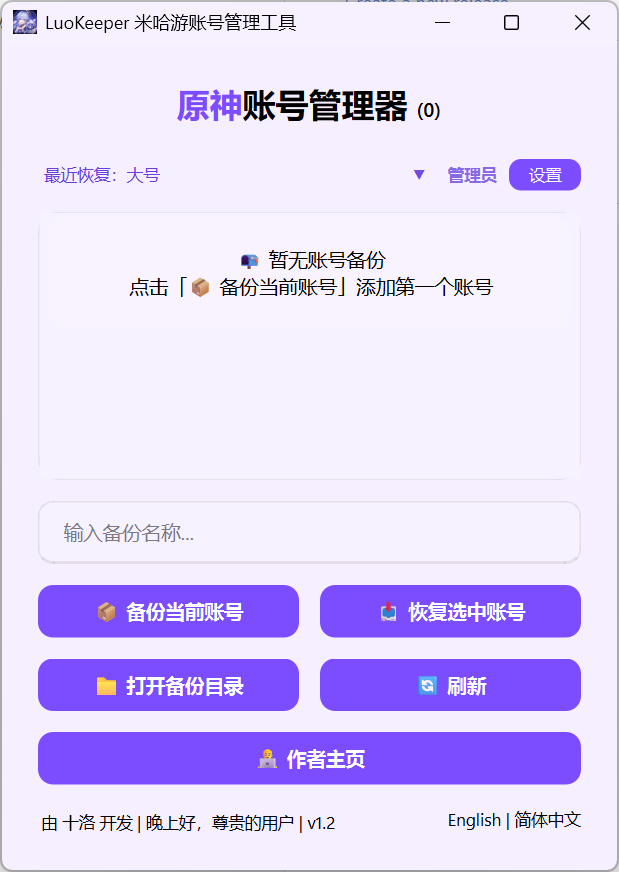
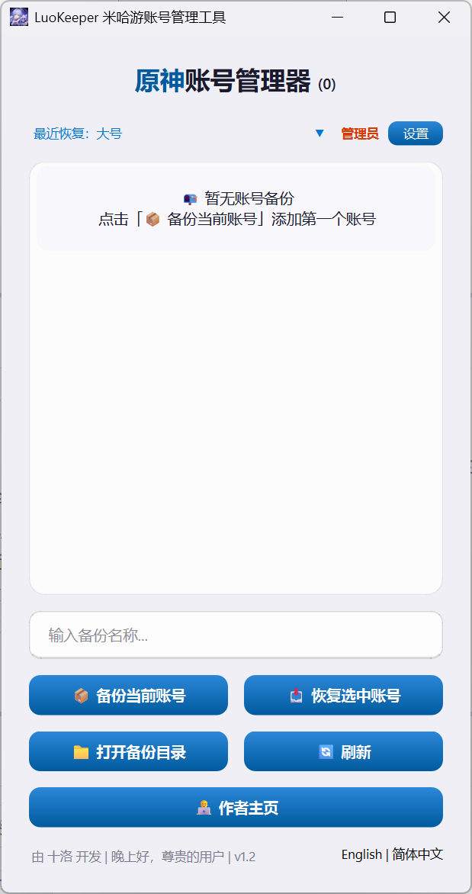
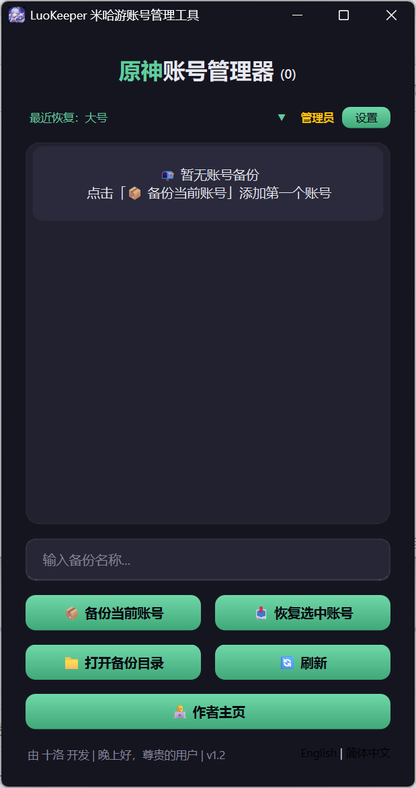
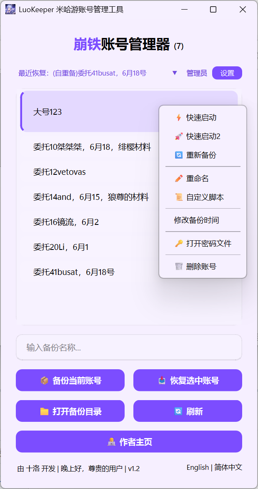

# LuoKeeper

LuoKeeper — 米哈游账号管理工具，支持原神、崩坏：星穹铁道、绝区零、崩坏3 国服与国际服的账号本地备份与快速切换，免重复扫码登录。

> **免费版**请前往：[B站介绍视频](https://www.bilibili.com/video/BV1dN9CBjE1R/) | [GitHub](https://github.com/Shilore0/miHoYoAccountManager) | [Gitee](https://gitee.com/Shilore0/miHoYoAccountManager)

  

---

## 功能介绍

- **账号备份与恢复** — 一键备份/恢复游戏登录凭证，切换账号无需重新扫码
- **快速启动** — 右键「快速启动」，自动恢复账号 → 启动游戏 → 自动重新备份
- **自动重新备份** — 恢复后自动检测时效，过期自动触发重新备份，可配置间隔与倒计时
- **8 游戏支持** — 原神/崩铁/绝区零/崩坏3 × 国服/国际服，点击标题栏切换
- **毛玻璃现代风主题** — 浅色/深色/自定义，Win11 云母效果，12 款预设
- **崩铁多开解锁** — 国服/国际服一键解锁/恢复
- **中英双语** — 底部按钮一键切换，即时生效
- **右键菜单** — 快速启动、重新备份、重命名、自定义脚本等

  
  
  

---

## 下载

| 平台 | 链接 |
|------|------|
| Gitee（国内推荐） | [LuoKeeper](https://gitee.com/Shilore0/LuoKeerper/) |
| GitHub | [LuoKeeper](https://github.com/Shilore0/LuoKeerper) |

每个版本提供两种下载包：

| 包名 | 说明 | 适用场景 |
|------|------|----------|
| `LuoKeeper_vX.X.X_Full.zip` | 完整包，包含 exe + 所有依赖 DLL | 首次安装 |
| `LuoKeeper_vX.X.X_Update.exe` | 更新包，仅包含 exe | 已安装旧版，覆盖替换即可 |

---

## 使用说明

1. 启动软件，选择主题
2. 在设置中配置游戏启动器路径（支持自动检测）
3. 登录游戏后，输入名称点击「备份当前账号」
4. 切换账号时，选中账号点击「恢复选中账号」
5. 也可右键选择「快速启动」，一键恢复+启动+自动重备

---

## 注意事项

- 备份文件包含登录凭证，请妥善保管，不要分享给他人
- 账号有效期约 3 天，建议开启「自动重新备份」
- Windows 11 云母效果需 22H2+，旧版自动降级

---

> 付费版。免费版请见上方链接。
